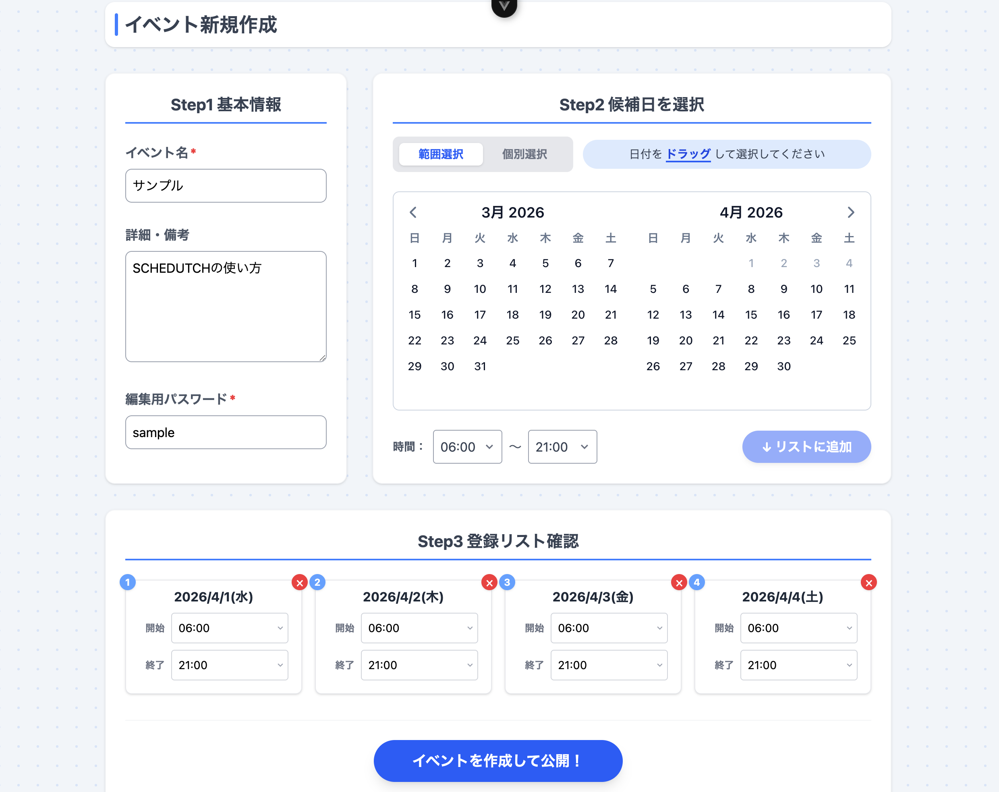
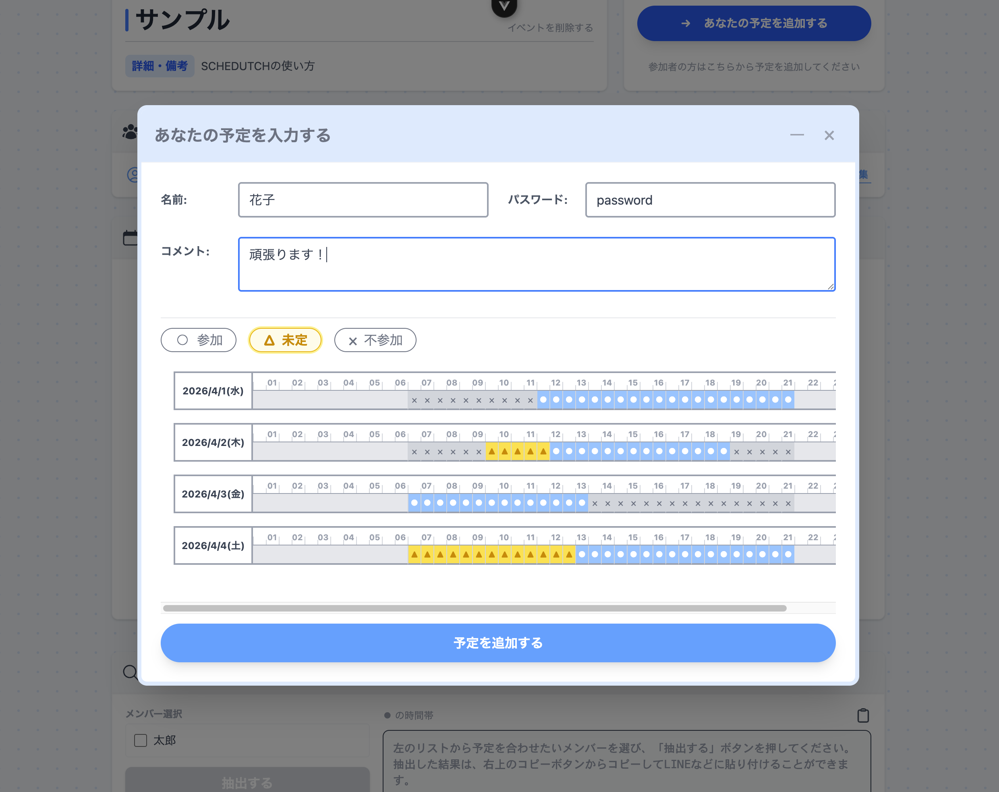
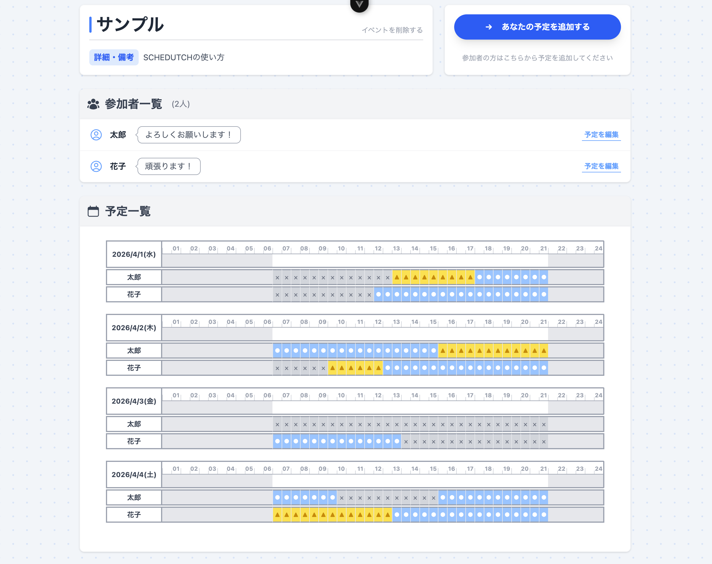
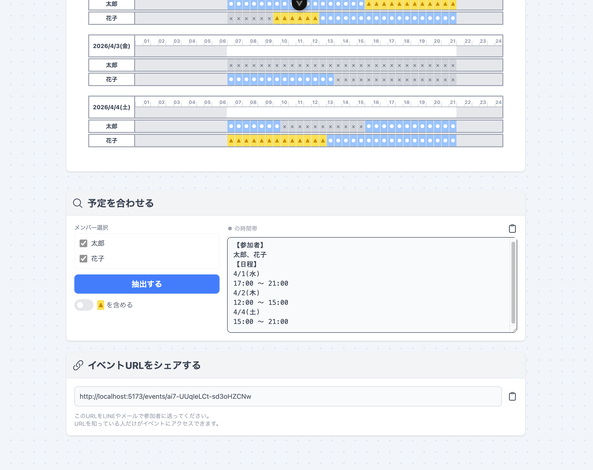
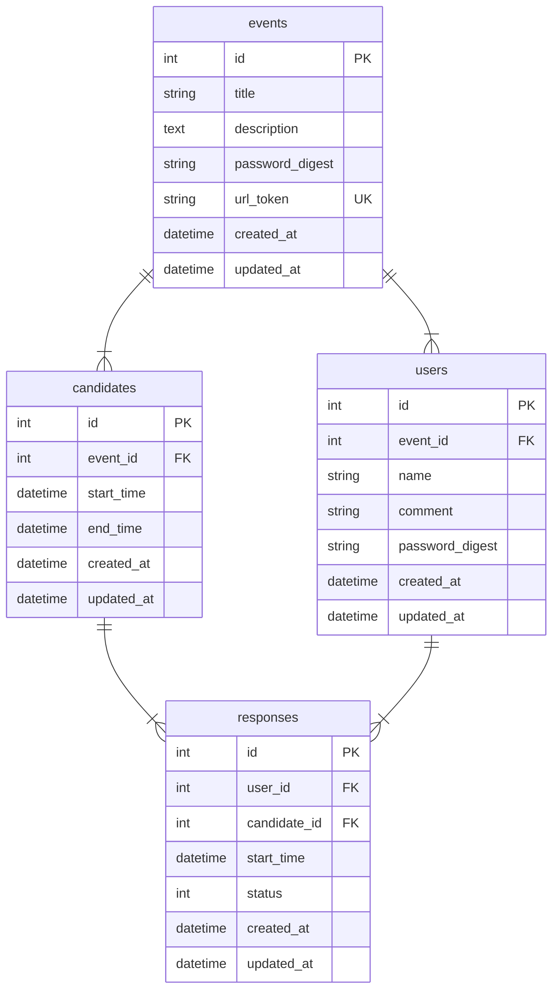

# SCHEDUTCH (スケダッチ)

### ログイン不要の日程調整ツール
**サービスURL** https://schedutch.vercel.app/

## 概要
SCHEDUTCHは、大量の日程調整を一瞬で完結させるためのWebアプリケーションです。
幹事が発行したURLを共有するだけで、参加者はアカウント作成せずに回答をできます。集まった回答から、選択した参加者の予定が合う日時をシステムが自動で抽出します。

## 開発背景
私の所属するサークルでは、パフォーマンスの練習時間を確保するために、何度も日程調整を行う必要がありました。その際、既存の日程調整ツールを利用していましたが、運用する中で2つの大きな課題に直面していました。

1. **モバイル端末での操作性・視認性の不足**\
既存ツールはPCでの利用が前提のような設計が多く、スマホからだと予定の表が一目で見渡せなかったり、回答ステップが多かったりと、急な予定の変更などがしにくい状況でした。

2. **集計・共有における二度手間の発生**\
既存ツールは回答を集める機能はあっても、その後の決定した日時の共有が自動化されていませんでした。集計が終わると、集まった表を目視で確認し、「◯月◯日 00:00〜00:00 全員出席可能」といった情報を手動で抽出し、LINE等に転記する作業が毎回発生していました。頻繁な調整が必要な環境において、この作業は予定調整における一番の負担となっていました。

これらの課題を解決すべく、他の既存ツールも検討しましたが、無料かつニーズに合致するものは見当たりませんでした。そこで、「ないのなら、理想のものを自分で作ろう」と考え、 SCHEDUTCH の開発に至りました。

## 主な機能
- **イベントの作成**\
イベントと名パスワードを入力し、カレンダーから候補日と時間を選びます。イベントを作成するとURLが発行され、参加者に共有するだけで準備は完了です。

- **日程への回答**\
共有されたURLからアクセスするだけでアカウント登録やログインの手間なく即座に回答可能です。
回答画面では、名前・パスワード・コメントを入力し、各候補日に対して「参加(◯)・未定(△)・不参加(×)」の3種類からワンタップで選択します。

- **回答の確認と集計**\
参加者の回答結果は一覧表で表示され、誰がいつ空いているかを目視で容易に把握できます。
集計機能により、特定の参加者を選択して予定が合う日時のみを抽出することが可能です。抽出結果はテキスト形式で表示されるため、そのままLINE等のチャットツールへ転記して決定事項を共有できます。

## 使用技術
| Category | Technology Stack |
| :---: | :--- |
| **Backend** | Ruby on Rails 8.1.2 (API Mode) |
| **Frontend** | Vue.js 3.5, Tailwind CSS 4.1 |
| **Testing** | RSpec / FactoryBot |
| **Database** | PostgreSQL |
| **Infrastructure** | Render (API), Vercel (Frontend), Neon (DB) |
| **Lint / Format** | ESLint / oxlint / Prettier |

## 技術選定理由
- ### バックエンド 
Rails の「設定より規約」という思想により、データベース設計から API エンドポイントの作成、バリデーション実装までを極めて迅速に行うことができます。そのため、「ユーザー体験を向上させる機能開発」にリソースを集中させるために採用しました。
また、Railsチュートリアルをはじめとする質の高い日本語ドキュメントやコミュニティの知見が豊富であり、開発中に直面した課題を自力で解決するための環境が整っていたことも大きな要因です。
- ### フロントエンド
Vue.jsは、HTML/CSS/JavaScriptを一つのファイルで構造的に分離して記述できるSFC（単一ファイルコンポーネント）を採用しています。本アプリでは説明不要で直感的に操作できるUIを目指していたため、デザインとロジックを切り分けて整理しやすく、高い開発スピードを維持できるVue.jsが最適だと判断しました。
また、ルーティング（Vue Router）等の周辺ライブラリが公式から提供されており、ベストプラクティスが標準化されている点も、個人開発において迷いなく構成を決めることができる大きなメリットでした。 \
スタイリングには Tailwind CSS を採用しています。クラス名を付与するだけで直感的にスタイルを構築できる点、ユーティリティファーストの思想により、レスポンシブ対応や一貫性のあるデザインを最小限のコード量で実現できる点で採用を決めました。
- ### データベース
Railsの標準的なデータベースであり、Active Recordの強力な機能を最大限に引き出すことができる ため、PostgreSQL を採用しました。
- ### インフラ
インフラ構成については、AWS等の複雑な構築よりも迅速なデプロイと機能開発を優先するためPaaSの採用を決定しました。各サービスの制限や料金体系を比較検討した上で、以下の構成を選択しています。
バックエンドのホスティングには、GitHubと連携したデプロイが容易なRenderを採用しました。フロントエンドに採用した Vercel についても、同様にデプロイの容易さと開発スピードを重視した結果です。また、データベースに関しては、Renderの無料プランにおけるデータ保持の制約を考慮し、外部のサーバーレスPostgresである Neon を切り出して連携させることで、データの永続性と運用の安定性を確保できるため、採用しました。
## データベース設計

## 📝 テーブル設計の補足

各テーブルの役割と、設計上の工夫は以下の通りです。

- **Events（イベント管理）** 
  イベントの基本情報を保持します。
  - `url_token`: ログイン不要で特定のイベントにアクセスできるよう、推測困難なランダム文字列を生成し、一意性を保証しています。
  - `password_digest`: イベントの編集・削除を行う際の認証に使用します。

- **Candidates（候補日時）**
  1つのイベントに紐付く、複数の候補日時（開始〜終了）を管理します。

- **Users（回答者）**
  回答したユーザーの情報を保持します。
  - `event_id`: アカウント作成を不要とするため、回答者データは各イベントに直接紐付けて管理しています。
  - `password_digest`: 回答者が後から自身の回答内容やコメントを編集・削除できるよう、回答ごとにパスワードを設定可能にしています。

- **Responses（回答詳細）**
  ユーザーごとの候補日時に対するステータスを保持します。
  - `status`: 「参加(◯)・未定(△)・不参加(×)」の状態を整数で管理しています。